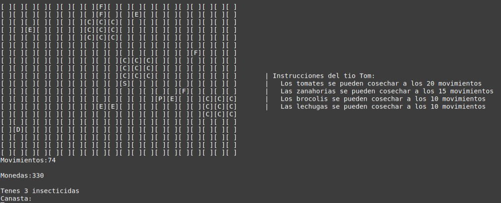

# 2D-Farm-game-developed-with-C
This is a university project where I had to develop a simple 2D game for the CMD. To run and test the game in linux, read the PDF and download the game folder. Then follow the instructions in the README text file :)

<h2>INSTRUCTIONS</h2>
To run the game on LINUX you should first compile the C files. 
  1. First, open CMD inside the "game" folder. 
  2. Enter the following command "gcc *.c -o juego -std=c99 -Wall -Wconversion -Werror -lm" to compile the required files. 
Now you are ready to play! Just enter the line "./juego" 

<h2>Running the Game on Windows or macOS</h2>

On both Windows and macOS, you can compile and run the game using a terminal.

<strong>Windows:</strong> 
1. Open CMD or PowerShell inside the "game" folder. 
2. Run the command: 
<code>gcc *.c -o juego.exe -std=c99 -Wall -Wconversion -Werror -lm</code> 
3. Then run: 
<code>juego.exe</code> 
(Requires GCC, like <a href="https://www.mingw-w64.org/">MinGW</a>)  

<strong>macOS:</strong> 
1. Open Terminal inside the "game" folder. 
2. Run the command: 
<code>gcc *.c -o juego -std=c99 -Wall -Wconversion -Werror -lm</code> 
3. Then run: 
<code>./juego</code> 
(Make sure Xcode Command Line Tools are installed) 

<h2>GAME INFO</h2>

Since Snow White moved in with the dwarfs, she inspired them to care for plants and enjoy the outdoors. And since the mine job is no longer enough and they’re struggling to make ends meet, they decided to invest in buying some plots of land to grow vegetables, sell them, and save some coins.
 
We must help Snow White grow her garden to reach her savings goal of 1000 coins. If she runs out of coins, the game is over.  
The game consists of a field where there are 3 plots (3x3) with different vegetables. You must plant seeds, harvest them once they’ve grown, and take them to the depot to sell and earn coins.  
Planting each type of vegetable has a different cost, just as each one has a different selling price. You must wait until they are ready to be harvested. 

<h3>Plots</h3>
There are 3 plots of size 3x3 (9 crops). You can plant any vegetable in the plots. The center crop is randomly positioned in the field, and from that center, the surrounding crops are generated.  
If a crop goes out of bounds, it should not be initialized. 

<h3>Obstacles</h3>
Obstacles are randomly placed on the field. Note that an obstacle cannot be placed on the same position as another object. 

<h3>Pests</h3>
They appear randomly on the field every 10 moves. If they land on one of the 3 plots, you will have 10 moves to save them, otherwise they will rot and disappear. 

<h3>Thorns</h3>
Five thorns are randomly placed on the field at the beginning of the game. Every time Snow White steps on one, she loses 5 coins. 

<h3>Tools</h3>
There are tools to help Snow White in her mission:

  <h4>Fertilizer</h4>
A fertilizer appears every 15 moves randomly on the field. It cannot be placed over another object or the character.  
When used on a plot's crop, it causes all the vegetables in that plot to grow. You pick them up one at a time. 

  <h4>Insecticides</h4>
At the beginning of the game, Snow White has 3 insecticides available. When used on a crop, they will cure the entire plot from pests. 

<h3>Depot</h3>
It is initialized at a random position. It cannot overlap with any other object. Snow White must take the harvested crops there to exchange them for coins.  
Once she is within Manhattan distance 2 of the depot, the harvested vegetables are exchanged for coins. 

<h3>Basket</h3>
To harvest vegetables, Snow White must stand over a crop that is ready and it will be added to her basket.  
The basket can carry up to 6 vegetables. When taken to the depot, the basket is emptied and she can harvest again.  
Note: Once harvested, vegetables do not rot. 

<h3>Plants</h3>
All plants have a cost to plant and grow after a certain number of moves.  
If they are not harvested in time, they disappear and the crop becomes available for a new vegetable: 

  <h4>Tomato</h4>
Planting tomato seeds costs 5 coins. Each tomato harvest (per crop) gives you 30 coins.  
It lasts 30 moves: after 20 it is grown and can be harvested, but if not picked within 10 more moves, it rots.  
Example: if you plant a tomato and walk 20 moves, it is ready. If you take more than 10 additional moves, it disappears. 

  <h4>Carrot</h4>
Planting carrot seeds costs 10 coins. Each carrot harvest gives you 50 coins.  
It lasts 25 moves: after 15 it is grown, and if not picked within 10 more moves, it rots. 

  <h4>Broccoli</h4>
Planting broccoli seeds costs 15 coins. Each broccoli harvest gives you 70 coins.  
It lasts 20 moves: after 10 it is grown, and if not picked within 15 more moves, it rots. 

  <h4>Lettuce</h4>
Planting lettuce seeds costs 20 coins. Each lettuce harvest gives you 80 coins.  
It lasts 15 moves: after 10 it is grown, and if not picked within 5 more moves, it rots. 

<h2>Game Controls</h2>
The character can move in 4 directions: 
Up: <b>W</b> 
Down: <b>S</b> 
Right: <b>D</b> 
Left: <b>A</b> 
The character <b>cannot</b> leave the field. So, if Snow White is on the first row and tries to go up, she won’t move and it won’t count as a move. 

To plant, <b>Snow White</b> must be on a plot's crop and press Z to plant carrot,  T for tomato, L for lettuce, and B for broccoli. 

To use <b>insecticide</b>, Snow White must be on a crop affected by pests and press I to activate it on the whole plot. 

To use <b>fertilizer</b>, Snow White must be on a plot's crop and press F to activate it on the whole plot. 

To harvest, simply stand on a crop when the plant is ready and still within the valid time window.  
If the crop isn’t ready, nothing happens. Vegetables affected by pests cannot be harvested. 

<h2>Game Goal</h2>
To win the game, Snow White must collect a total of 1000 coins. The starting amount depends on the dwarf from TP1: 
   Gruñón: 150 coins 
   Dormilón: 200 coins 
   Sabio: 250 coins 
   Feliz: 300 coins 

<h2>Characters Letters</h2>
<ul>
  <li>Blancanieves: S.</li>
  <li>Cultivo vacío: C.</li>
  <li>Depósito: D.</li>
  <li>Espinas: E.</li>
  <li>Plagas: P.</li>
  <li>Fertilizantes: F</li>
  <li>Lechuga: L.</li>
  <li>Tomate: T.</li>
  <li>Zanahoria: Z.</li>
  <li>Brócoli: B.</li>
</ul>

<h2>Hope you like it! Made by Tomás Bobbett in 2023</h2>
